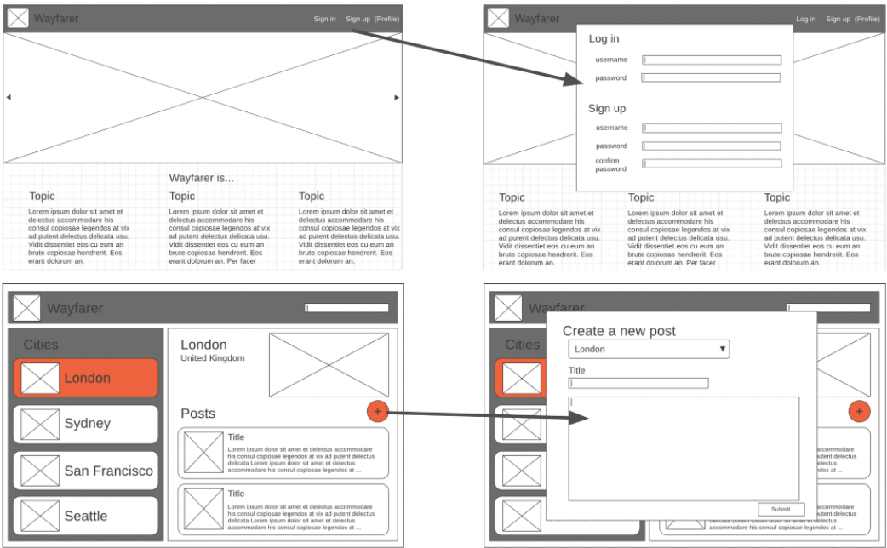
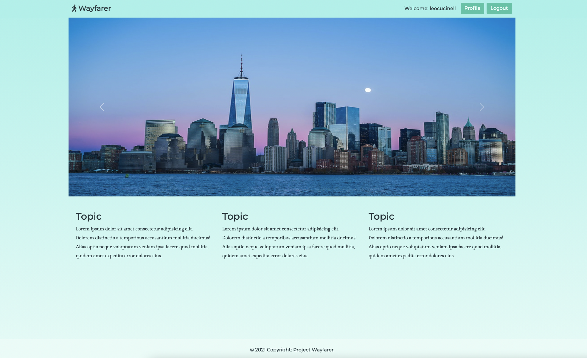
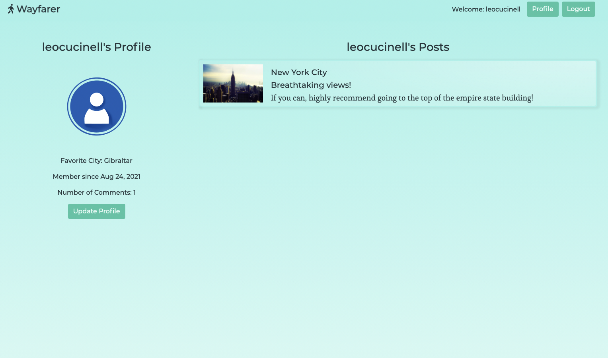
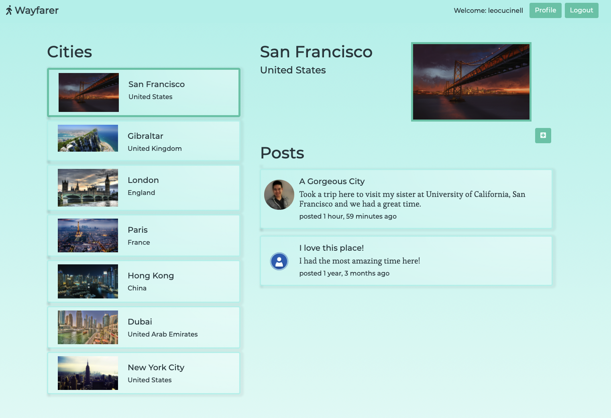
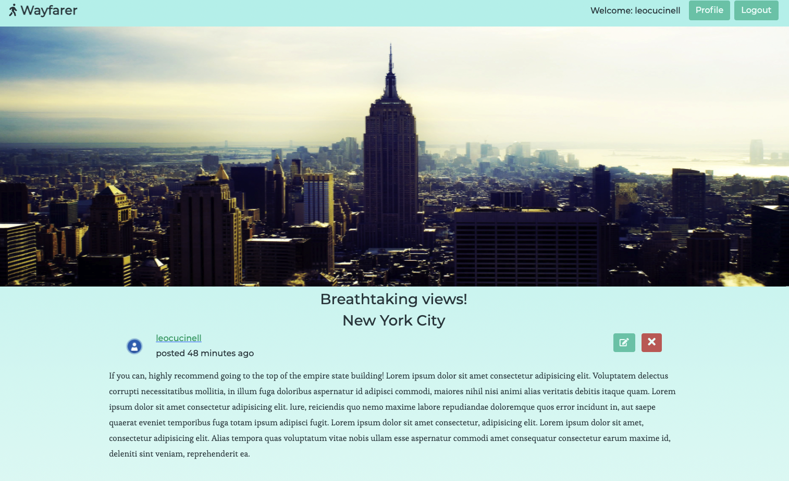
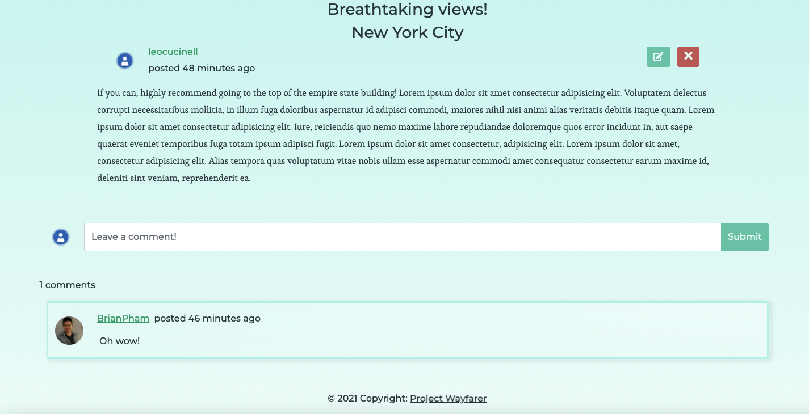

# Project-Wayfarer

## Description
Project Wayfarer is a full stack city blogging application built for a group of clients where users can create articles and make comments on their world travels. Clients provided wireframes, user stories, sprints, and design choices upon which our team was to execute their designed application. Utilizing pair programming and a collaborative environment, we exceeded client expectations within the 1 week deadline. Built with Django and PostgreSQL.

[Check out the app!](https://bestwayfarer.herokuapp.com/) 
 
 Per client requests, please be aware that users must have an account in order to view the main contents.

# Technologies 
<ul>
    <li>Django</li>
    <li>PostgreSQL</li>
    <li>Python</li>
    <li>DTL</li>
    <li>Bootstrap</li>
    <li>HTML5</li>
    <li>CSS3</li>
    <li>Heroku</li>
</ul>

# User Stories
<h3>Sprint 1: Basic Auth and Profiles</h3>
A user should be able to:
<ol>
    <li>Navigate to "/" and see a basic splash page with:
        <ul>
            <li>The name of the website.</li>
            <li>Links to "Log In" and "Sign Up".</li>
        </ul>
    </li>
    <li>Sign up for an account.</li>
    <li>Log in to their account if they already have one.</li>
    <li>Be redirected to their public profile page after logging in.</li>
    <li>On their public profile page, see their name, the current city they have set in their profile, and their join date.</li>
    <li>See the site-wide header on every page with:
        <ul>
            <li>A link to "Log Out" if they're logged in.</li>
            <li>Links to "Log In" and "Sign Up" if they're logged out.</li>
        </ul>
    </li>
    <li>Update their profile by making changes to their name and/or current city.</li>
    <li>See the titles of all the posts they've contributed (start with pre-seeded data).</li>
    <li>Click on the title of one of their posts and be redirected to a "show" page for that post.</li>
    <li>View post "show" pages with title, author, and content.</li>
</ol>

<h3>Sprint 2: Full CRUD</h3>
A user should be able to:
<ol>
    <li>View the "San Francisco" page (at "/cities/1") including:
        <ul>
            <li>The site-wide header.</li>
            <li>The name of the city.</li>
            <li>An iconic photo of the city.</li>
        </ul>
    </li>
    <li>View a list of posts on the San Francisco page:
        <ul>
            <li>Sorted by newest first.</li>
            <li>With the post titles linked to the individual post "show" pages.</li>
        </ul>
    </li>
    <li>Use an "Add New Post" button on the San Francisco city page to pull up the new post form.</li>
    <li>Create a new post for San Francisco.</li>
    <li>Click "Edit" on ANY individual post, and be redirected to the edit form.</li>
    <li>Click "delete" on ANY individual post, then:
        <ul>
            <li>See a pop-up that says: "Are you sure you want to delete #{title}?"</li>
            <li>If the user confirms, delete the post.</li>
        </ul>
    </li>
</ol>

<h3>Sprint 3: Validations and Authorization</h3>
A user should be able to:
<ol>
    <li>View city pages for "London" and "Gibraltar".</li>
    <li>Verify that a new post they create is successfully published on the correct city page.</li>
    <li>A user CANNOT save invalid data to the database, according to the following rules:
        <ul>
            <li>A post's title must be between 1 and 200 characters.</li>
            <li>A post's content must not be empty.</li>
        </ul>
    </li>
    <li>A user is authorized to perform certain actions on the site, according to the following rules:
        <ul>
            <li>A user MUST be logged in to create/update/destroy resources.</li>
            <li>A user may only edit/delete their own posts.</li>
            <li>A user may only edit their own profile</li>
            <li>Users must be authenticated to view any page besides the splash page.</li>
        </ul>
    </li>
</ol>
<h3>Sprint 4: Commenting </h3>
A user should be able to:
<ol>
    <li>Comment on individual posts.</li>
    <li>See the number of comments a post has on the post's "show" page.</li>
    <li>See the number of comments they've left, on their public profile.</li>
    <li>Only add a comment when logged in.</li>
    <li>Only edit/delete their own comments.</li>
</ol>

# Wireframes

# Photos

